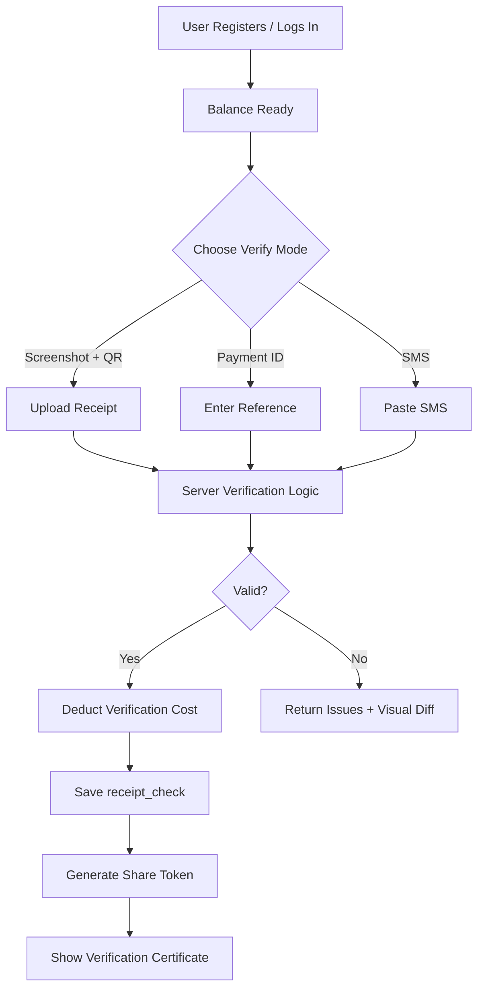
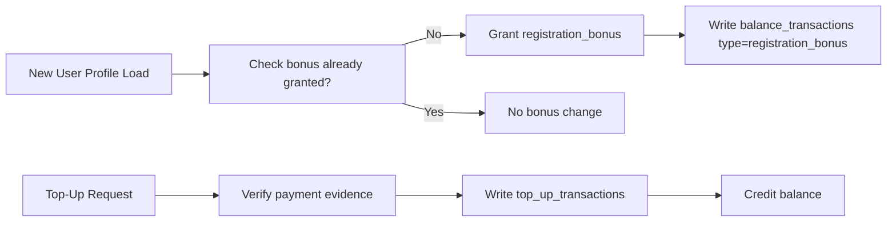
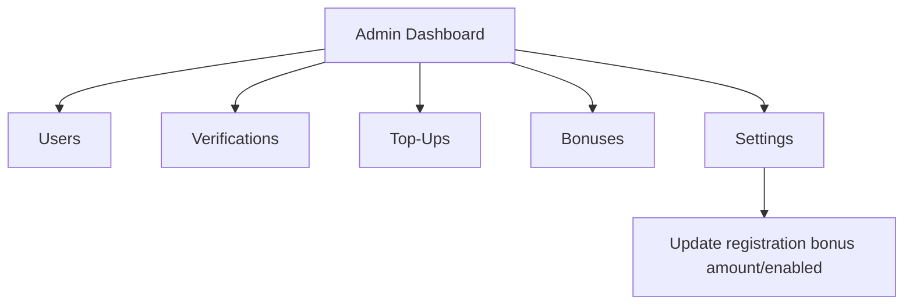

# Deresegn

Deresegn is an Ethiopian payment verification platform that helps users verify receipts across multiple providers (Telebirr, CBE, BOA, Dashen), manage verification balance, and share proof as a verification certificate.

## What It Does

- Verifies payments using:
  - Screenshot + QR
  - Payment ID / reference
  - SMS (supported methods)
- Uses tiered verification cost based on amount.
- Gives one-time registration bonus (configured as a **registration bonus**, not top-up).
- Supports shareable verification certificates.
- Includes admin dashboard for users, verifications, top-ups, bonuses, and settings.

## Tech Stack

### Client (`client/`)

- React + Vite
- Redux Toolkit
- React Router
- Tailwind + custom CSS

### Server (`server/`)

- Node.js + Express
- Drizzle ORM + PostgreSQL
- Better Auth
- Gemini API (receipt extraction)
- Cloudinary (image storage)

## Project Structure

```text
deresegn/
  client/      # Frontend app
  server/      # Backend API, auth, DB, verification logic
```

## Quick Start

### 1) Install dependencies

```bash
cd server && npm install
cd ../client && npm install
```

### 2) Configure environment

Copy `server/.env.example` to `server/.env` and set your values.

Required core variables:

- `DATABASE_URL`
- `BETTER_AUTH_SECRET`
- `BETTER_AUTH_URL`
- `CLIENT_URL`
- `GEMINI_API_KEY`
- `CLOUDINARY_CLOUD_NAME`
- `CLOUDINARY_API_KEY`
- `CLOUDINARY_API_SECRET`

### 3) Run database migration

```bash
cd server
npm run db:migrate
```

### 4) Start development servers

Terminal 1:

```bash
cd server
npm run dev
```

Terminal 2:

```bash
cd client
npm run dev
```

Client runs on `http://localhost:5173`  
Server runs on `http://localhost:5000`

## Scripts

### Server

- `npm run dev` — start API with nodemon
- `npm run start` — start API with node
- `npm run db:migrate` — apply migrations
- `npm run db:studio` — open Drizzle Studio

### Client

- `npm run dev` — start Vite dev server
- `npm run build` — production build
- `npm run preview` — preview build

## Visual Flow

### End-to-End User Verification Flow



### Registration Bonus vs Top-Up Flow



### Admin Monitoring Flow



## Core API Areas

- `/api/check` — verification endpoints
- `/api/balance` — balance + top-up endpoints
- `/api/users/me` — authenticated profile + bonus check
- `/api/admin/*` — admin dashboard, settings, operations
- `/api/check/certificate/:token` — public verification certificate lookup

## Notes

- Registration bonus is tracked separately from top-ups.
- Verification costs are dynamic by amount tier.
- For production, ensure secure secrets, proper CORS origin, and SSL-enabled DB connection.
